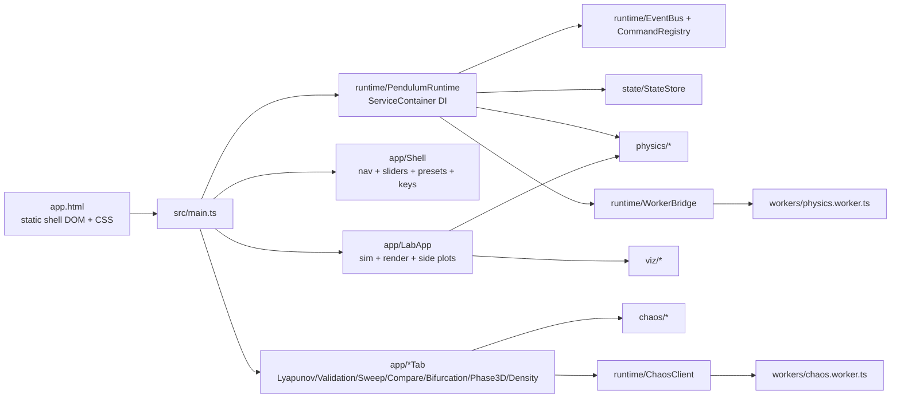

# Architecture

Pendulum Lab V10 is a **100% TypeScript** application. The original ~8,080-line legacy
`js/` runtime has been fully removed (preserved in git history under the
`legacy-js-archive` tag). The live Vite shell
(`app.html`) loads `src/main.ts` plus the hand-written CSS that styles the static shell
DOM; the ignored `standalone/` directory holds the generated self-contained release
build, whose hashes are committed in `standalone-manifest.json`. A single
dependency-injection container (`runtime/ServiceContainer`, exposed through
`window.PendulumLabDebug.runtime`) is the canonical source of truth for runtime services.

## Layered Architecture

The codebase is split into a **domain layer** (pure, browser-free, deterministic) and an
**infrastructure layer** (DOM, workers, globals, browser APIs). The domain layer never
imports the infrastructure layer, which keeps the physics/chaos engine unit-testable in
Node and reusable outside the browser.

| Layer | Packages | May depend on | Must NOT depend on |
|---|---|---|---|
| Domain (pure) | `physics/`, `chaos/`, `viz/` (math), `validation/` (checks), `export/manifest` | other domain modules, `types/` | DOM, `window`, workers, `runtime/` |
| Application/runtime | `runtime/ServiceContainer`, `runtime/PendulumRuntime`, `EventBus`, `CommandRegistry`, `StateStore`, `app/Shell`, `app/LabApp`, `app/*Tab` | domain layer, `types/` | DOM specifics leaking into domain |
| Infrastructure | `runtime/*Bridge`, `render/performance`, `ui/`, `workers/` | application + domain | — |

The legacy `js/` runtime has been removed (see the `legacy-js-archive` git tag). The former
`runtime/LegacyBridge` and `runtime/IndexPhysicsBridge` shims are gone; only
small compatibility accessors remain for old scripts and tests that still read
`window.App`, `window.Physics`, `window.PendulumLabIndex`, or
`window.PendulumRuntime`.

## Dependency Injection Container

`ServiceContainer<M>` is a zero-dependency typed container: lazy singletons by default,
optional transients, throwing `resolve` plus non-throwing `tryResolve`, and a typed
service map `PendulumServiceMap`. `installPendulumRuntime()` registers `events`,
`commands`, `state`, `physics`, and `worker`, then publishes the DI surface under
`window.PendulumLabDebug.runtime` with `window.PendulumRuntime` kept as a
deprecated debug alias. Public scripting uses `window.PendulumLab`.

## Module Boundaries

- `src/app/`: the modern Lab application layer — `LabSimulation` (headless integration core driving the typed `physicsAdapter`), `LabRenderer` (canvas pendulum renderer targeting the structural `Ctx2D`, legacy-parity geometry: pivot at `w/2, h·0.38`, 110 px/m), `LabController` (`mountModernLab`, an independently-mountable rAF loop), and `LabApp` (the full lab tab: loop + energy/Lyapunov/phase/Poincaré/FFT side plots + control wiring). Analysis helpers: `fft`, `PoincareAccumulator`, `LyapunovEstimator`, `labPlots`. Mounted by default in browser contexts; `?modernLabProbe` still mounts a standalone probe for diagnostics.
- `src/physics/`: typed equations, energy helpers, integrator metadata, and pure integrator implementations.
- `src/state/`: strict StateStore snapshot validation, state synchronization, and import-safe runtime patches.
- `src/runtime/`: central event bus, command registry, public/debug API publishing, compatibility accessors, and module worker bridge.
- `src/ui/`: safe DOM helpers and accessibility upgrades.
- `src/validation/`: deterministic validation checks and strict JSON import parsing.
- `src/export/`: typed submission manifest and report export helpers.
- `src/render/`: runtime metric probes for FPS, physics time, memory, and worker latency.
- `src/workers/`: separate module worker with main-thread fallback through `WorkerBridge`.
- `app.html`: the live Vite shell (static shell DOM + CSS); it loads `src/main.ts`, which boots the runtime, Lab, analysis tabs, and shell. `npm run build:standalone` emits the self-contained portable release file into ignored `standalone/`; release automation publishes it as a GitHub Release asset.

## Research Workbench Boundary

`src/app/parity/research-workbench.ts` is now a small compatibility barrel. The
workbench implementation is split by user workflow rather than retained in one
UI orchestrator:

- Pure, reusable research primitives live in `src/research/` and are exported
  through the grouped `research` public API.
- Local-storage and IndexedDB schema normalization live in
  `src/app/parity/storage-sync.ts` and `src/research/researchDb.ts`.
- Visual card/table helpers live in `research-ui-components.ts` and
  `research-renderers.ts`; comparison matrix assembly lives in
  `research-comparison.ts`; superpack analysis panels live in
  `superpack-panels.ts`.
- The run-log renderer now lives in `research-run-log.ts`, keeping table-only
  rendering out of the main workbench orchestrator.
- Workspace/session persistence and run recording live in
  `research-workspace-controller.ts`; batch target/spec helpers live in
  `research-batch-runner.ts`; design-study parsing, rendering, and interaction
  are divided among `research-design-controller.ts`,
  `research-design-renderers.ts`, and `research-workbench-design-study.ts`.
  Experiment-library, parameter-study, rendering, and export-panel workflows
  likewise have dedicated `research-workbench-*` or `research-export-panels.ts`
  modules with focused unit or e2e coverage.
- Canvas capture, figure captions, portable PNG/SVG paths, and the figure
  manifest model live in the unit-tested `paper-figure-capture.ts`; artifact
  orchestration remains in `figure-export.ts`. Command registration likewise
  lives in `governance-commands.ts`, separate from governance DOM rendering.

## Module Size Ratchet

`npm run audit:modules` walks every non-declaration TypeScript source file and
fails when a module exceeds the 650-line default. The current source tree has no
known-large exceptions: former orchestrators were split into smaller, tested
workflow, rendering, protocol, storage, and physics modules. Any future
exception must be added explicitly with an owner and a tighter ratchet; the
preferred response remains extracting a coherent responsibility before the
module grows past the default.

## Public API Surface (minimized)

The public scripting API is `window.PendulumLab` (`{ version, commands, events,
state, physics }`). Internal tooling uses `window.PendulumLabDebug`, including
the DI runtime surface (`runtime: { version, container, resolve, tryResolve,
has, events, commands, state, describe }`) and modern app handles. Deprecated
aliases (`window.PendulumLabIndex`, `window.PendulumRuntime`, `window.__modernLab`,
`window.__modernTabs`) remain for compatibility.

## Legacy Removal (complete)

The migration ran in four verifiable stages, each keeping `npm run typecheck`, `npm test`,
the Playwright e2e suite, and `npm run audit:legacy` green so the legacy-risk score only
ever moved down (482 → 0):

1. **Runtime unification.** Single DI container; the five legacy globals collapsed to one
   namespace + read-only accessors; dynamic `<script>` injection removed.
2. **Modern Lab as default.** `src/app/LabApp` drives the lab tab — simulation loop, all
   side plots, controls, presets, ensemble, FX, drag-to-set, export, and replay.
3. **Analysis tabs.** Lyapunov, Validation, Sweep, Compare, Bifurcation, 3D-phase, and
   density were each ported (taking over their controls by cloning the buttons to drop the
   legacy handlers) and covered by unit + e2e tests.
4. **Shell + cut.** `src/app/Shell` took over navigation, slider displays, presets, and
   keyboard shortcuts; audio was ported (`AudioSonifier`); `LabApp` took over the header
   chrome. The legacy `<script>` tags were removed from `index.html` and `js/00`–`js/11`
   moved to `archive/` (since removed from the working tree; preserved at the
   `legacy-js-archive` tag). The app is now served entirely from `src/` via Vite.

The bridge shims were deleted after their useful responsibilities moved into
`src/main.ts`, `runtime/globalApi.ts`, and the modern shell.
